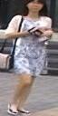

# CSCE 625 Project: Person Reidentification
Final project for CSCE-625 with Dr. Wang

## Team Members
- Ryan Wells
- Ankit Ramchandani
- Benton Guess

## Trained models
- [Autoencoder](https://drive.google.com/open?id=1uiabGqF4G_FGbZZa2kAX7pkW23iJsjwc)
- [Segmentation](https://drive.google.com/open?id=1WWaFnycqDLttI6Qmf5VwqCVt4idJTFUf)
- [Siamese Network](http://bguess.site/#scalars&_smoothingWeight=0)

## Examples of Our Segmentation Network

## How to run the model
- Confirm that `scipy`, `pytorch`, `numpy`, `PIL`, `tensorboardX`, and `cv2` are all installed. For a complete list of modules needed specifically for the segmentation network, please see [here](https://github.tamu.edu/rawells14/csce-625-person-re-identification/blob/master/segmentation/requirements.txt)
- Run images through the segmentation network with the `process_images` function in the `segmentation` module:
    *Ex: process_images("/datasets/DukeMTMC-reID/bounding_box_test/", "/datasets/DukeSegmented/test/")*
- Take these segmented images and run the Siamese Network on them with: `python3 main.py`
        - Add `--resume network.tar` if you would like to resume from a previously trained pth model
        - Be sure to modify the `train_dataset` location in `main.py` to your designated segmented images
        - To train, run `train(_train_loader, _model, _criterion, _optimizer, _epoch, _print_freq)`
        - To test, run `test(_test_loader, _model, _criterion, _epoch, _print_freq)`
        - The tensorboard event data (using tensorboardX) will be written to the /runs/ directory. 

## Some of our results

### Examples from our segmentation network: 
#### Unsegmented from Market-1501

#### Segmented from Market-1501

